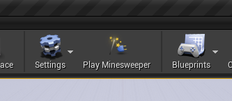
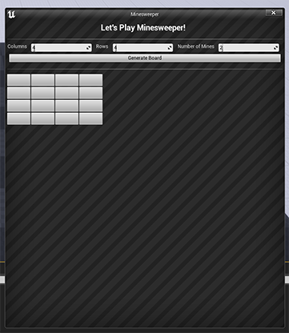
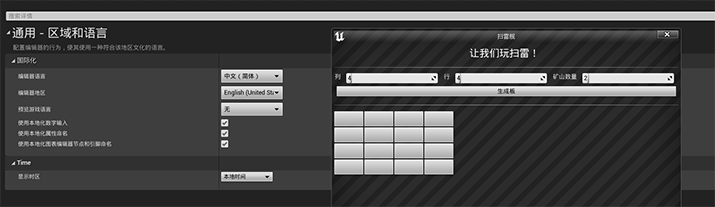
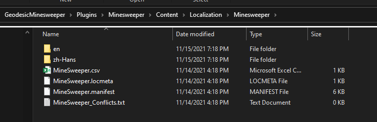
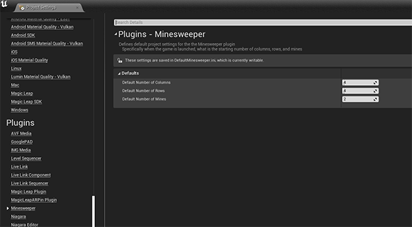

# Geodesic Minesweeper
 
## Starting Approach

I started by creating a the standard toolbar plugin through UE4 and then extended it to add the Minesweeper game. I also used the beta of Jetbrains Rider for Unreal Engine for my IDE.

## Running 

When running UE4 you should see the toolbar button "Play Minesweeper"

Click on that button and the game should launch. 

There are 3 numeric spin boxes that allow for the player to choose the number of columns, rows, and mines. Clicking on "Generate Board" will generate a new game board for the player. 

## Additional Features 

As a way to highlight my familiarity with Unreal Editor development I added 2 features that weren't part of the original brief.

### Localization 

If you change the editor's language to Simplified Chinese, the game will be translated. 

These translations were from Google and just for demostration and shouldn't be checked for accuracy. The localization resourses are also why the plugin also has a content directory.

### Project Settings 

You can also change the default values of the columns, rows, and mines spin boxes by editing the Minesweeper project settings in the editor. 

## Architecture

To maintain true seporation of concerns, there are several main classes that I created. 

* FMinesweeperModule: Manages the wiring up the features games interface and releated commands. 
* SMinesweeperWidget: The game's UI. There is a static function defined (Display) that launches a new window and instantiates the widget within it. 
* FMinesweeperGame: The actual game class that managages all the game logic.

There are other miscellaneous classes that exist 

* UMinesweeperSettings: UObject class that contains all the default project settings for the plugin
* FMinesweeperStyle: Defines the additional styling for the UI that is different than the default. A red button for when the user clicks on a mine for example. 
* FMinesweeperCommands: Contains the actions that the user can take to be able to use the Minesweeper game
